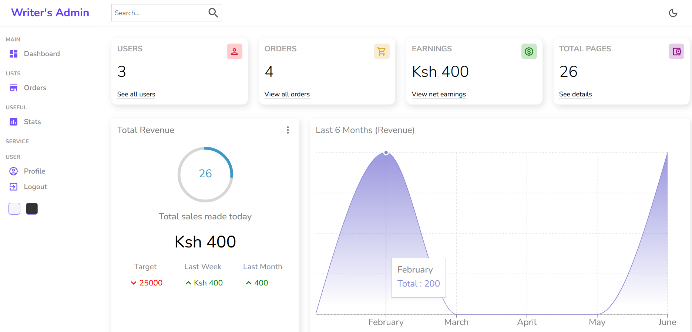
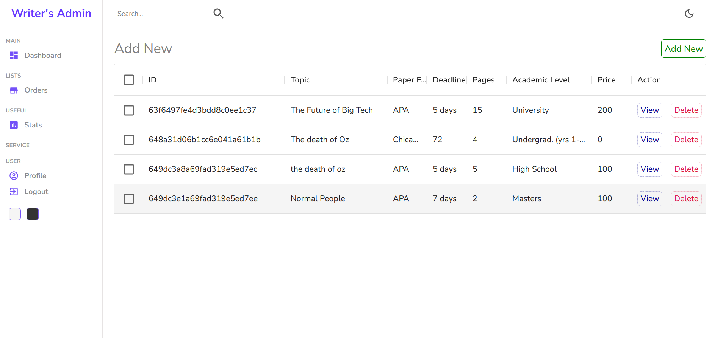
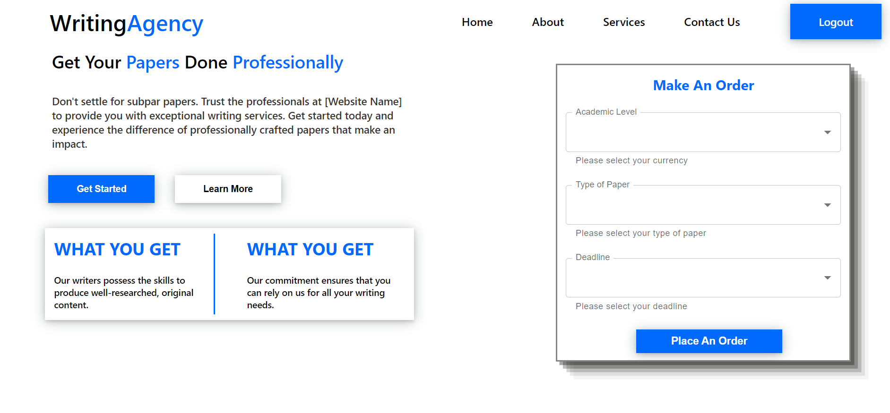
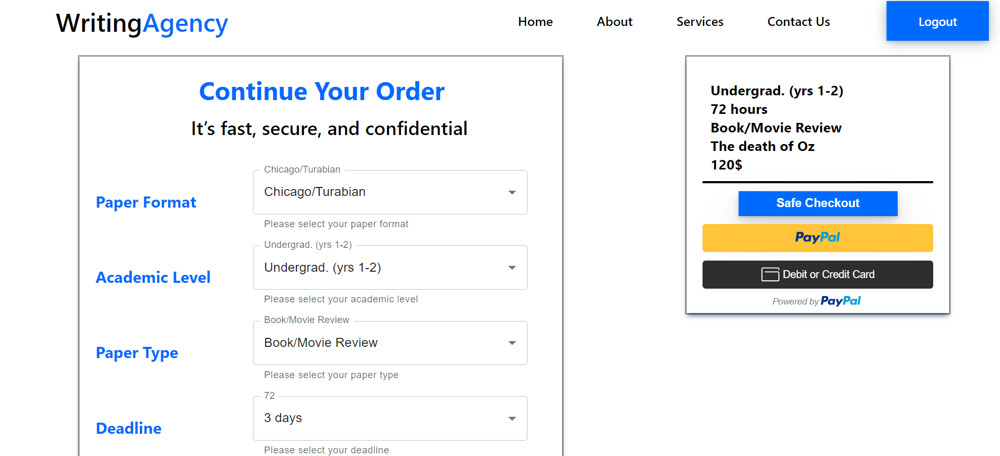

# Essay Writer Website and Admin Panel

This repository contains a web application that serves as an essay writer website with an accompanying admin panel. It provides a platform for users to submit essay requests and for administrators to manage and fulfill those requests efficiently.

    
    

    
    

## Features

- **User Registration and Authentication**: Users can create accounts, log in, and authenticate themselves to access the full functionality of the essay writer website.
- **Essay Request Submission**: Users can submit essay requests by providing details such as topic, word count, deadline, and any specific requirements.
- **Order Management**: The admin panel allows administrators to view and manage all essay requests, including assigning requests to available writers and tracking the progress of each order.
- **Payment Integration**: The system supports secure payment processing, allowing users to make payments for their orders through integrated payment gateways.
- **Admin Dashboard**: The admin panel provides a comprehensive dashboard for administrators to monitor and manage user accounts, orders, payments, and other system settings.

## Technologies Used

- **Front-end**: React.js, HTML, CSS
- **Back-end**: Node.js, Express.js
- **Database**: MongoDB
- **Authentication**: JSON Web Tokens (JWT)
- **Payment Integration**: Stripe API
- **File Upload**: Cloudinary API

## Getting Started

To get started with the Essay Writer Website and Admin Panel, follow these steps:

1. Clone this repository: `git clone https://github.com/Eddychase/essay-writer-website-and-adminpanel.git`
2. Navigate to the project directory: `cd essay-writer-website-and-adminpanel`
3. Install dependencies for the client-side (frontend) application: `cd client && npm install`
4. Install dependencies for the server-side (backend) application: `cd ../server && npm install`
5. Set up environment variables: Rename `.env.example` to `.env` in both the `client` and `server` directories and provide the required configuration values.
6. Start the development server for the client-side: `cd client && npm start`
7. Start the development server for the server-side: `cd ../server && npm start`

Ensure that you have MongoDB and Node.js installed and running on your machine before starting the application.

## Contributing

Contributions to the Essay Writer Website and Admin Panel are welcome! If you encounter any issues or have suggestions for improvements, please open an issue on the GitHub repository. If you would like to contribute code, please fork the repository, make your changes, and submit a pull request.

## License

The Essay Writer Website and Admin Panel is open-source software licensed under the [MIT License](https://opensource.org/licenses/MIT).

